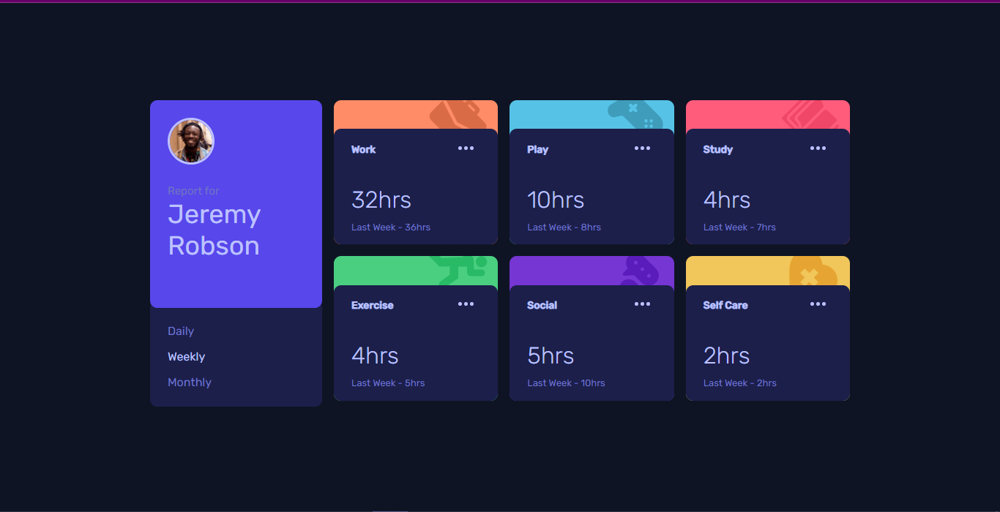

# Frontend Mentor - Time tracking dashboard solution

### Screenshot



- Solution URL: [solution URL](https://github.com/Jemi-code/Time_Tracker)
- Live Site URL: [live site](https://jemi-code.github.io/Time_Tracker)

## My process

### Built with

- Semantic HTML5 markup
- CSS custom properties
- Flexbox
- CSS Grid
- Mobile-first workflow
- [Sass](https://sass-lang.com/) - Sass Framework

```css
 position: relative;
  z-index: 1;
  /* turns out, z-index only works with elements of position relative, absolute, fixed or sticky! */
```
```js
fetch('data.json')
.then((response) => {
    return response.json();
})
.then((data) => {
    appendData(data);
})
.catch((err) => {
    console.log(`Error: ${err}`);
});
// my first time working with apis and json files. Felt good to have it figured out
```
- Frontend Mentor - [@Jemi-code](https://www.frontendmentor.io/profile/Jemi-code)